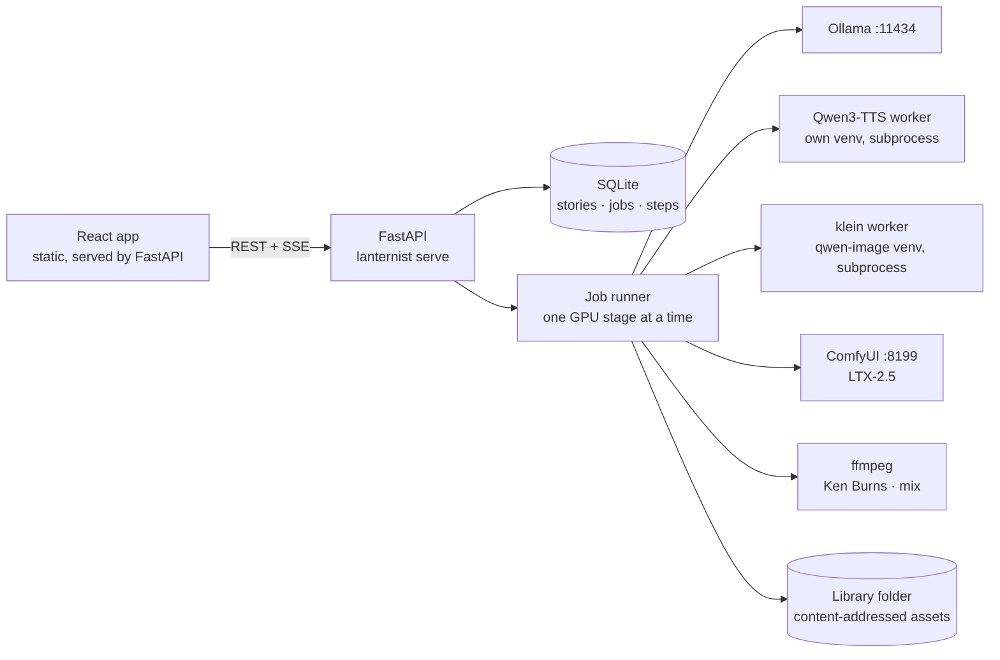
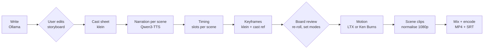

# Lanternist MVP: implementation plan

> **Status, 21 Sep 2026: the MVP works.** Phases 0–3 are built, and the acceptance test below passed on this machine through the web UI with real models. Phase 4 is partly done: per-scene camera moves and subtitles off/sidecar/burned are built.
>
> Measured on the RTX 5090:
> - Writer: 30 s for a 13-scene story.
> - Board (narration, cast sheet, 13 keyframes): 5.4 min.
> - Render with 3 video scenes: 5 min, for 3:23 of film.
> - Redrawing one scene's picture: 25 s.
> - Re-render after editing one scene: 49 s.
> - The 12-scene Maya film in full video: 13 min.
>
> Changes from the plan:
> - The app runs on port 8420, because 8080 is taken by another service on this machine.
> - Lanternist starts ComfyUI itself when it's down.
> - The writer revises a draft that misses its target length by more than 15%.
> - Hybrid mode caps video at about 30% of scenes.
> - Still scenes always get a camera move.
>
> Still open from Phase 4: motion intensity and pace controls, aspect ratios, wind-down, previews jumping the queue, and extra TTS engines with per-character voices.

**Goal:** on this machine (RTX 5090, 32 GB VRAM, 60 GB RAM), go from a one-line idea to a narrated MP4 story film, in the browser, using only local models.
**Source:** the *Story Studio Blueprint* artifact (revised 21 Sep 2026) and the working prototype in `~/ai/bedtime-stories`.
**MVP = the blueprint's M0 + M1, plus local video from M3**, cut down to one machine. No accounts, credentials, fal, credits or packaging.

Definition of done (the acceptance test at the end of Phase 3):

1. `lanternist serve`, then open `http://127.0.0.1:8080`.
2. Type an idea, pick Spanish, kids 5–8, 3 minutes → get a storyboard. Edit one scene's text.
3. Prepare the board: narration + cast sheet + one keyframe per scene. Re-roll one keyframe.
4. Set 3 scenes to video, the rest to stills. Render. Watch the MP4 in the browser with narration, ambience and subtitles, and download it.
5. Edit one scene and re-render: only that scene's steps and the final mix run again.

No terminal use after `serve`.

---

## 1. What is already on this machine

Everything the MVP needs is installed and has already produced films (`outputs/video/maya-and-the-mountain-breeze-animated.mp4`, 126.9 s, 1080p).

| Stage | Engine (default in bold) | Where it lives | How the MVP calls it |
|---|---|---|---|
| Writer | **Ollama `qwen3.8`** (27B q4, 17 GB), `qwen3.6`, `gemma4` | `ollama serve` on :11434, v0.32.14 | HTTP `/api/chat` with a JSON-schema `format` |
| Narration | **Qwen3-TTS 1.7B** (Apache, 10 languages, clones from a reference clip) | `~/ai/bedtime-stories/engines/qwen3tts` (own venv, transformers 4.57.3) | Subprocess worker in that venv |
| Narration (alt) | Breeze TTS 2 (en/zh, non-commercial), VibeVoice 1.5B | same folder, own venvs | Later; same worker pattern |
| Cast sheet + keyframes | **FLUX.2 [klein] 9B**, diffusers, CPU offload, 4 steps, guidance 1.0 | weights `~/ai/flux2-klein-9b/weights` (33 GB); runs in `~/ai/qwen-image-2.1/.venv` (diffusers 0.41 dev, torch 2.11 cu128) | Subprocess worker in that venv |
| Video | **LTX-2.5 22B nvfp4** image-to-video + generated ambience | ComfyUI 0.37 at `~/comfyui`, running on 127.0.0.1:8199 | ComfyUI HTTP API with the graph from `animate_ltx.py` |
| Stills motion | ffmpeg `zoompan` (Ken Burns) | `/usr/bin/ffmpeg` | Subprocess |
| Assembly | ffmpeg `h264_nvenc` | same | Subprocess |
| Alignment | faster-whisper | `tools/.venv` | Not needed: per-scene TTS gives exact timings |

Also present but not used by the MVP: Qwen-Image 2.1 (diffusers and a second ComfyUI in `~/ai/comfyui`), FLUX.2 [dev] fp8, Z-Image Turbo, FLUX.1 schnell (all in `~/comfyui/models`).

**The constraint that shapes the design:** these models don't fit on the card together. Right now ComfyUI sits idle holding 23.5 GB (LTX is resident). Ollama keeps `qwen3.8` (17 GB) loaded for 5 minutes after each call. klein needs CPU offload even with the card empty. Each stage has to evict the others before it starts.

---

## 2. Architecture

One Python process: FastAPI serves the API, the static React app and SSE progress, and runs one in-process job runner on SQLite. Engines run where they already are.



Stages always run in this order, each batched across all scenes so every model loads once per job:



### Decisions (and why)

1. **Engines run as batch subprocess workers inside their existing venvs, not as long-lived servers.** A process exiting is the only VRAM release you can count on. The venvs pin incompatible `transformers` (4.57.3 vs 5.17), and the app's own venv stays free of torch. A worker is a standalone script: it reads a JSON job file and prints JSONL progress (`loaded`, `item_done`, `error`). The `Engine` protocol from the blueprint sits on top, so a localhost server can replace a worker later without touching callers.
2. **One GPU lease, stages batched by model.** Before a stage, the runner evicts Ollama (`keep_alive: 0` for each model in `/api/ps`) and ComfyUI (`POST /free {"unload_models":true,"free_memory":true}`). It then waits until NVML reports enough free VRAM. After 60 s it fails with the PIDs that still hold the card. This is the blueprint's "group by model" scheduler at its simplest: one job at a time.
3. **Narration comes first, one step per scene.** Each scene's wav is its own cached step. Real durations set the slot lengths, so every picture and clip is exactly as long as its words. Chunk-level durations also give accurate subtitle timings for free.
4. **Content-addressed step cache.** Step key = sha256 of the step kind, engine id and version, parameters, the final prompt text, the seed and upstream asset hashes. Outputs are stored as `assets/ab/cd/<sha>.<ext>`. When a key already exists, the step is skipped. This replaces the prototype's "skip if the file exists".
5. **Each scene renders to its own normalised clip** (1920×1080, 24 fps, yuv420p, stereo 48 kHz ambience or silence, slot length + 0.8 s crossfade handle). The final mix only crossfades clips and lays the narration on top. Editing one scene re-encodes one clip plus the mix. Stills and video scenes mix freely, so hybrid mode costs nothing extra.
6. **A two-pass writer.** Pass 1 writes the story prose in the story's language. Pass 2 turns it into the storyboard JSON: cast, per-scene visual, motion and sound prompts in English, through Ollama structured output (`format` = the Pydantic JSON schema, `think: false`, `num_ctx` 16k). Pydantic validates the result, with one repair retry. Prose written inside a JSON field comes out worse than free prose.
7. **The character lock is deterministic.** Each scene lists its cast ids, and the prompt builder appends those characters' `look` text and the style suffix to every keyframe and motion prompt. The prototype proved that restating the cast in every prompt is what stops drift, so the code does it instead of trusting the LLM to.
8. **ComfyUI is used only through its API:** `/upload/image`, `/prompt`, `/history/{id}`, `/view`, `/free`, `/interrupt`. Nothing is copied into its folders. The LTX graph from `animate_ltx.py` becomes a JSON template with slots for image, text, frames, size and seed.

### Repository layout

```
lanternist/
  pyproject.toml              # uv; fastapi, uvicorn, sqlalchemy, alembic, pydantic, httpx, typer, nvidia-ml-py
  lanternist.example.toml     # engine venv paths, URLs, library dir, defaults
  src/lanternist/
    config.py
    storyboard.py             # Pydantic models = the Storyboard JSON schema
    prompts.py                # prompt builder: cast lock, style suffix, negatives
    importers/prototype.py    # stories/<name>.txt + .prompts/.cast/.motion → storyboard.json
    writer/                   # Ollama client, two-pass writer, audience/kind templates, scene rewrite
    engines/
      base.py                 # Engine protocol, StepInput/StepOutput
      gpu.py                  # lease, eviction (Ollama, ComfyUI), NVML wait
      subprocess_worker.py    # JSON job in, JSONL progress out, cancel = kill
      qwen3tts.py  klein.py  ltx_comfy.py  kenburns.py  assemble.py
      fake.py                 # ffmpeg testsrc/sine stand-ins for tests and UI work
    workers/                  # run INSIDE engine venvs; stdlib + that venv only
      tts_qwen3.py  image_klein.py
    comfy/ltx25_i2v.json      # graph template
    pipeline/
      graph.py                # storyboard version + job kind → steps
      cache.py                # step keys, asset store
      timing.py               # slots, shot split, subtitle cues
      runner.py               # jobs, stages, progress, cancel, resume
    db/                       # SQLAlchemy models + Alembic migrations
    api/                      # routes, SSE, static files
    cli.py                    # doctor · import · write · board · render · serve
  web/                        # Vite + React + TS, built into src/lanternist/api/static
  tests/
```

### Data (SQLite, one file in the library folder)

| Table | Holds |
|---|---|
| `story` | id, slug, title, language, created |
| `story_version` | storyboard JSON; every save is a new version |
| `job` | kind (`write`, `cast`, `board`, `render`, `reroll`), story version, status, error, timestamps |
| `step` | job, kind, scene, cache key, engine, status, output asset, seconds, error |
| `asset` | sha256, kind, path, duration, width, height |

Cast and scenes live inside the storyboard JSON; the MVP needs no tables for them. The schema is the blueprint's data model with the hosted-only tables left out, so it grows without being rewritten.

---

## 3. Phases

Each phase ends with something that runs end to end. Rough sizes assume one developer working with Claude Code.

### Phase 0: foundations (≈1 day)

- [ ] `uv init` a `src/` package, ruff, pytest; `lanternist.example.toml` pointing at the venvs and URLs in section 1.
- [ ] `storyboard.py`: the blueprint's Storyboard JSON, plus `scene.cast` (ids), `scene.seed`, `story.voice`, `story.style`, `story.seed`, and `mode` per scene (`still` / `video`).
- [ ] `importers/prototype.py`: converts Maya and we-the-people from their sidecars (`.txt` paragraphs, `.prompts.txt` with `STYLE:`, `.cast.txt`, `.motion.txt` motion + sound lines).
- [ ] `lanternist doctor`: GPU and free VRAM (NVML, with the PIDs holding it), Ollama up and `qwen3.8` present, ComfyUI up and the LTX files in its model lists, each worker venv importing its libraries, klein weights present, ffmpeg with `h264_nvenc` and `libass`, disk space in the library folder.

**Exit:** `lanternist doctor` is all green; `lanternist import ~/ai/bedtime-stories/stories/maya-and-the-mountain.txt` writes a valid `maya.json` with 12 scenes.

### Phase 1: the render core, from the CLI (≈4 days)

- [ ] `workers/tts_qwen3.py`: loads the model once and builds the clone prompt once, then per scene: chunks at sentence boundaries (including `。！？`), synthesises, writes one wav per scene and returns chunk durations. Maps language codes to Qwen3-TTS names (`es` → `Spanish`).
- [ ] `workers/image_klein.py`: loads the pipeline once with CPU offload and VAE tiling. Renders the cast sheet at 1024×1024, then keyframes at 1920×1088 (klein needs sizes divisible by 16), with the cast sheet as the reference image and a fixed seed per scene.
- [ ] `engines/ltx_comfy.py`: uploads the keyframe, submits the templated graph, polls history and downloads the MP4 through `/view`. Frames = `ceil((slot + 0.8) × 24 / 8) × 8 + 1`, capped at 481 (20 s). Slots longer than 19.5 s are split into shots, and each later shot starts from the previous shot's last frame (`ffmpeg -sseof`).
- [ ] `engines/kenburns.py`: the `zoompan` chain from `video.py` (2× oversample, alternating push-in and pull-out), rendered per scene at slot length + handle.
- [ ] `engines/assemble.py`: normalises scene clips, chains `xfade` + `acrossfade` centred on scene boundaries, ducks ambience to 0.3 under the narration, fades in and out, writes a sidecar `.srt` (optionally burned in) and encodes with `h264_nvenc` at 12 Mb/s, AAC 192k and `+faststart`.
- [ ] `pipeline/timing.py`: narration track = scene wavs joined with 0.45 s gaps; slot *i* runs until scene *i+1* starts; the last slot gets a 1.5 s tail; subtitle cues come from chunk durations, split at 90 characters.
- [ ] `gpu.py` lease and eviction; `cache.py`; `graph.py`; a `runner.py` that works without the database for now (the CLI prints progress).
- [ ] CLI: `lanternist board story.json` (cast, narration, keyframes) and `lanternist render story.json [--mode still|video|hybrid]`.

**Exit:**
- `lanternist render maya.json --mode video` rebuilds the Maya film: 12 scenes, about 127 s, with ambience.
- `--mode still` produces the stills version.
- A second run finishes in under 10 s, with every step served from cache.
- Changing scene 4's `visual` re-runs only keyframe 4, clip 4 and the mix.
- Starting with ComfyUI and Ollama both resident still works.

### Phase 2: the writer (≈2 days)

- [ ] Pass 1 (prose): a system prompt built from audience, kind, language, length and notes. Target words = minutes × a per-language speech rate (start at 150 wpm for English and 130 for Spanish and Portuguese, then correct from measured narrations). Paragraphs of 25–40 words, so most slots fit one LTX shot.
- [ ] Pass 2 (storyboard): English visual, motion and sound prompts; cast looks; `cast` ids per scene; sound lines that say "no speech, no music"; style chosen from presets (watercolour, 3D film, paper cut-out, clay, ink & pencil, anime).
- [ ] Audience tiers written into the prompts (toddlers, kids 5–8, 9–12, teens, adults), as in the blueprint's safety table. No moderation models in the MVP.
- [ ] `rewrite_scene(storyboard, n, instruction)`: the LLM sees the whole storyboard and returns only scene *n*.
- [ ] The cast-sheet prompt is built from the cast looks and the style, using the Maya `.cast.txt` wording as the template.
- [ ] CLI: `lanternist write "idea" --lang es --audience kids_5_8 --minutes 3 -o luna.json`.

**Exit:** ideas in English, Spanish and Portuguese each give a valid storyboard within ±15% of the target length, and each renders end to end with no manual edits.

### Phase 3: the web app (≈4 days)

- [ ] SQLite + Alembic with the tables in section 2. The runner moves in process: one asyncio worker takes jobs FIFO and persists step state, so a restart resumes and cached steps skip. Cancel kills the worker subprocess or calls ComfyUI `/interrupt`.
- [ ] API: `POST /api/stories` (write job), `GET/PUT /api/stories/{id}` (a PUT saves a new version), `POST …/scenes/{n}/rewrite`, `POST …/cast`, `POST …/board`, `POST …/render`, `POST …/scenes/{n}/reroll` (bumps the seed), `GET /api/jobs/{id}/events` (SSE, same shape as the blueprint's snippet), `GET /api/assets/{sha}` (with range requests for video), `GET /api/doctor`, `GET/POST /api/voices` (list `voices/*.wav`, upload a reference clip + transcript).
- [ ] React screens, following the blueprint's sketches without prices:
  - **New** (sketch A): idea, audience, kind, language, length, notes.
  - **Story & cast** (sketch B): scene list with editable narration and prompts; cast looks; draw or re-roll the cast sheet.
  - **Board** (sketch E): per scene, the keyframe, a play button for its narration, its duration, a still/video toggle and re-roll; an "Approve & render" button.
  - **Render**: step progress over SSE, then the player with MP4 and SRT downloads.
  - **Library**: stories and finished films.
  - **Doctor**: the health checks.
- [ ] `lanternist serve` binds 127.0.0.1:8080 and serves the built static files; `web` has a Vite dev proxy for development.

**Exit:** the definition of done at the top of this file.

### Phase 4: directing and polish (≈2–3 days, after the MVP works)

- [ ] Camera presets per scene for stills (push-in, pull-out, pan left or right) and as a camera phrase in the LTX motion prompt.
- [ ] Motion intensity (zoom rate; LTX image strength 0.7 by default), pace (TTS gap, tail), aspect ratios 16:9, 9:16 and 1:1.
- [ ] Subtitles off / sidecar / burned in; Noto fonts, including CJK.
- [ ] Wind-down over the last third: longer fades, a warmer and dimmer grade.
- [ ] Previews jump the queue: one keyframe or a voice sample runs ahead of a queued render.
- [ ] Optional: Breeze and VibeVoice adapters; per-character voices.

**Exit:** a 5-minute hybrid film in Spanish, made from an idea, with per-scene camera moves and burned-in subtitles.

---

## 4. Time on the 5090 (a 5-minute film, 25 scenes)

From the blueprint's measured rates:

| Step | Rate | 5-minute film |
|---|---|---|
| Narration, Qwen3-TTS | 0.46 GPU-s per s of audio | ≈ 2.5 min |
| Keyframes, klein 9B | 15 s per frame | ≈ 6.5 min + load |
| Video, LTX-2.5 | 4.3 GPU-s per s of video | ≈ 22 min if every scene is video |
| Ken Burns + mix, NVENC | ≈ 0.2 s per s of film | ≈ 1–2 min |

The board costs about 10 minutes. The film after that takes a few minutes in stills mode and 25–40 minutes in full video. Hybrid lands in between, which is why a stills preview comes before any video.

---

## 5. Testing

- **Unit tests:** storyboard validation, the prototype importer, slot and shot-split maths, cache keys, the prompt builder, subtitle cues, and the ffmpeg filtergraph builder as golden strings.
- **Fake engines** (`LANTERNIST_FAKE_ENGINES=1`): ffmpeg `testsrc2` frames and sine-wave narration in place of every model. The whole pipeline, the API and the UI run in seconds with no GPU, so every phase is testable in CI.
- **GPU smoke test** (`pytest -m gpu`, on this machine): a 2-scene story, one still and one video scene, about 3 minutes.
- **Golden test:** Maya imported and rendered in video mode should match the prototype's scene count and total length (126.9 s ± 1 s).

---

## 6. Risks for the MVP

| Risk | Mitigation |
|---|---|
| Something else holds VRAM (Open WebUI reloads Ollama models; ComfyUI idles at 23.5 GB) | Evict, wait on NVML, then fail with a clear message naming the PIDs. The doctor shows the same. |
| RAM pressure: klein offload keeps about 35 GB of weights in 60 GB of RAM | Unload Ollama first. The doctor warns below 40 GB free. |
| The LLM ignores length or structure | Schema-constrained output, a word-count check, one repair retry, then a deterministic split of long paragraphs. |
| LTX stops at 20 s per generation | The shot split in Phase 1, and 25–40-word paragraphs from the writer. |
| Characters drift | Cast sheet as the reference plus deterministic restating of looks. Keep klein 9B, which is what works today. |
| ComfyUI isn't running | The doctor catches it. Optional: `lanternist` starts `~/comfyui/.venv/bin/python main.py --listen 127.0.0.1 --port 8199` as a managed child process. |
| Non-Latin scripts | The sentence splitter handles `。！？`, and subtitles use Noto CJK (check with `fc-list`). |

---

## 7. Out of scope for the MVP

fal and bring-your-own-key, the estimator, credits and holds, hosted edition (Postgres, R2, Clerk, Stripe), moderation models, voice-clone consent and watermarking, music generation (no local music model yet; LTX ambience only), the multi-story GPU scheduler with VRAM budgets, hardware profiles and benchmarks, engine installers, desktop packaging, and Windows, macOS and AMD support. The step cache, `Engine` protocol, registry-shaped config and SQLAlchemy schema are all built so these slot in later without rewrites.

## 8. Assumptions (say if any is wrong)

- **Name and package:** `lanternist`, in `~/ai/projects/lanternist`.
- **Library folder:** `~/Lanternist`, configurable.
- **Default narrator:** `voices/demo.wav` until you record one with `record.sh` or upload one in the app.
- **Keyframes:** klein 9B's non-commercial licence is fine for personal use on this machine. Z-Image Turbo (Apache 2.0, already in ComfyUI) is the later swap for commercial use, but it takes no reference image, so consistency would drop.
- **Engines:** the existing venvs and weights stay where they are and are referenced by path. The MVP installs nothing into them.
